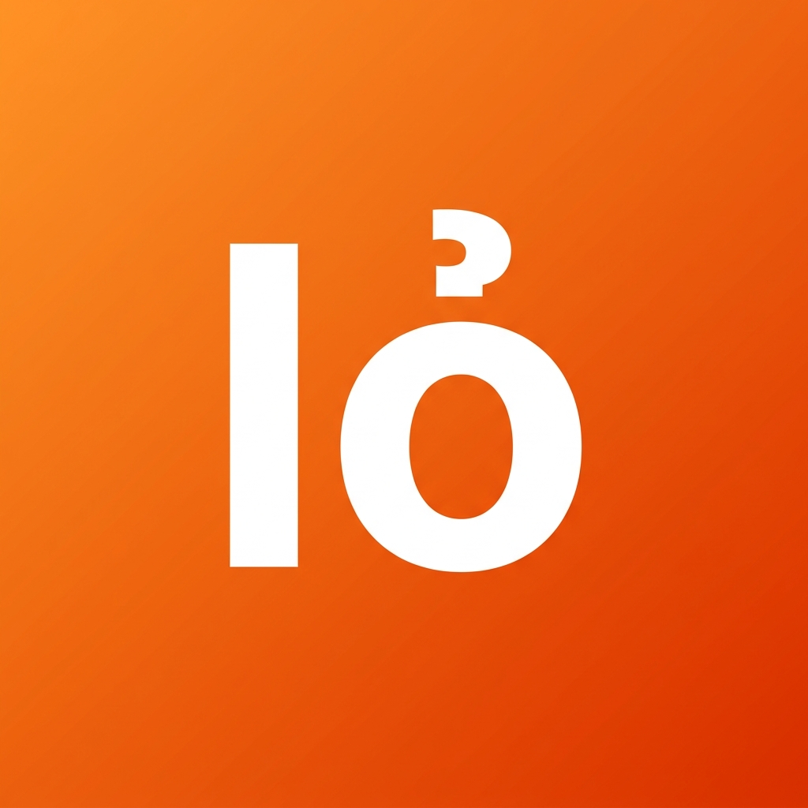

<div align="center">
  
  <h1>AIỎ - Quản lý Đa Nền Tảng Mạng Xã Hội</h1>
  <p><b>Giải pháp All-In-One Social chuyên nghiệp, siêu tốc & bảo mật dành cho Windows.</b></p>
  
  <p>
    
    
    
  </p>
</div>

---

**AIỎ** là phần mềm cho phép bạn quản lý đến **12 nền tảng mạng xã hội** (Facebook, Zalo, Telegram, TikTok, Discord...) trên một cửa sổ duy nhất. Với kiến trúc *Sandbox Partitions* cô lập hoàn toàn, bạn có thể đăng nhập nhiều tài khoản trên cùng một nền tảng mà không lo xung đột hay khóa tài khoản.

## 🚀 Hướng dẫn Tải và Cài đặt (Dành cho Người Dùng)

Bạn không cần biết về lập trình để sử dụng ứng dụng này. Chỉ cần làm theo 3 bước sau:

1. Truy cập trang **[Releases (Bản phát hành)](https://github.com/nct88/aio-social-multi-win/releases)** của dự án.
2. Tìm phiên bản mới nhất (ví dụ: `v1.0.0`) và tải về tệp có đuôi `.exe` (ví dụ: `AIỎ-Setup-1.0.0.exe`).
3. Nháy đúp vào tệp vừa tải về để cài đặt. Phần mềm sẽ tự động cài đặt và tạo biểu tượng trên màn hình Desktop của bạn.

> **Lưu ý**: Phần mềm có tính năng **Tự động cập nhật (OTA)**. Ở các phiên bản sau, bạn chỉ cần mở ứng dụng, AIỎ sẽ tự động tải bản cập nhật mới nhất mà không cần tải lại file cài đặt!

## ✨ Tính năng Nổi Bật

- 🌐 **Hỗ trợ 12 Nền Tảng**: Messenger, Zalo, Telegram, WhatsApp, Discord, X (Twitter), Instagram, TikTok, Threads, WeChat, Lotus, Meta Business.
- 👥 **Đa Tài Khoản**: Chuyển đổi siêu tốc giữa hàng chục nick chỉ với 1 click.
- 🛡️ **Cô lập Dữ liệu (Sandbox)**: Tách biệt hoàn toàn Cookies, Cache giữa các tài khoản. An toàn tuyệt đối.
- 🔐 **Khóa Bảo Mật (PIN)**: Hỗ trợ tự động khóa phần mềm bằng mã PIN sau thời gian không sử dụng.
- 🎨 **Giao diện Tùy Chỉnh**: Hỗ trợ Dark/Light mode toàn hệ thống. Tích hợp thanh công cụ nhanh (Zoom, Mute, Tải lại).
- 📥 **Sao lưu / Khôi phục**: Xuất toàn bộ phiên đăng nhập ra file mã hóa, chuyển sang máy khác dùng ngay mà không cần quét QR lại.

---

## 🛠 Dành cho Nhà Phát Triển (Developers)

Nếu bạn muốn tùy biến và build ứng dụng từ mã nguồn, vui lòng đảm bảo máy tính đã cài đặt [Node.js](https://nodejs.org/) (phiên bản LTS).

**1. Clone và cài đặt thư viện:**
```bash
git clone https://github.com/nct88/aio-social-multi-win.git
cd aio-social-multi-win
npm install
```

**2. Chạy môi trường Dev:**
```bash
npm start
```

**3. Đóng gói phần mềm (.exe):**
```bash
npm run build
```
File thành phẩm sẽ được đặt trong thư mục `dist/`.

---

<div align="center">
  <b>Phát triển với đam mê ❤️ bởi Nguyễn Công Trường</b><br><br>
  <a href="https://truong.me/">🌐 Portfolio</a> &nbsp;&middot;&nbsp; 
  <a href="https://truong.me/donate/">☕ Ủng hộ</a> &nbsp;&middot;&nbsp; 
  <a href="https://t.me/congtruongit">💬 Telegram</a> &nbsp;&middot;&nbsp; 
  <a href="https://fb.me/congtruongit">📘 Facebook</a>
  <br><br>
  Bản quyền © 2026 bởi truong.me.
</div>
